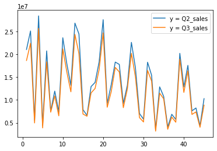
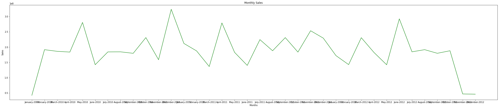
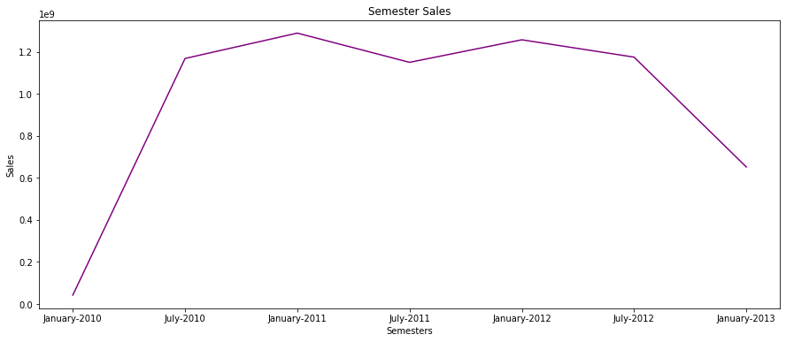
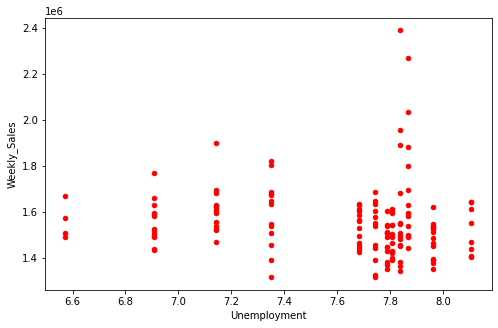
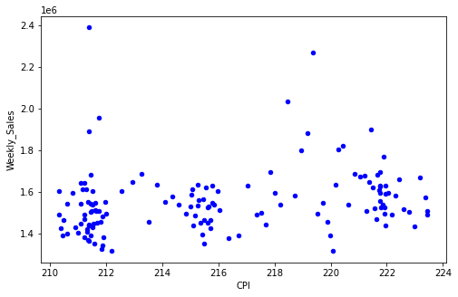
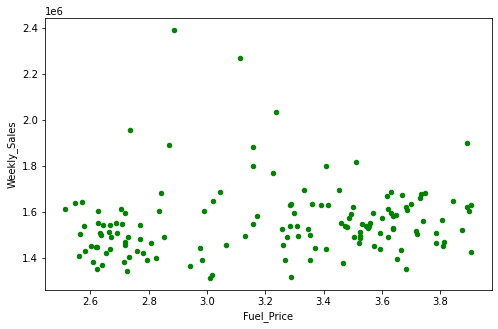

# Retail Analysis with Walmart Data


## DESCRIPTION

One of the leading retail stores in the US, Walmart, would like to predict the sales and demand accurately. There are certain events and holidays which impact sales on each day. There are sales data available for 45 stores of Walmart. The business is facing a challenge due to unforeseen demands and runs out of stock some times, due to the inappropriate machine learning algorithm. An ideal ML algorithm will predict demand accurately and ingest factors like economic conditions including CPI, Unemployment Index, etc.

Walmart runs several promotional markdown events throughout the year. These markdowns precede prominent holidays, the four largest of all, which are the Super Bowl, Labour Day, Thanksgiving, and Christmas. The weeks including these holidays are weighted five times higher in the evaluation than non-holiday weeks. Part of the challenge presented by this competition is modeling the effects of markdowns on these holiday weeks in the absence of complete/ideal historical data. Historical sales data for 45 Walmart stores located in different regions are available.

### Dataset Description

This is the historical data that covers sales from 2010-02-05 to 2012-11-01, in the file Walmart_Store_sales. Within this file you will find the following fields:

- **Store** - the store number

- **Date** - the week of sales

- **Weekly_Sales** -  sales for the given store

- **Holiday_Flag** - whether the week is a special holiday week 1 – Holiday week 0 – Non-holiday week

- **Temperature** - Temperature on the day of sale

- **Fuel_Price** - Cost of fuel in the region

- **CPI** – Prevailing consumer price index

- **Unemployment** - Prevailing unemployment rate

### Holiday Events

- **Super Bowl:** 12-Feb-10, 11-Feb-11, 10-Feb-12, 8-Feb-13
- **Labour Day:** 10-Sep-10, 9-Sep-11, 7-Sep-12, 6-Sep-13
- **Thanksgiving:** 26-Nov-10, 25-Nov-11, 23-Nov-12, 29-Nov-13
- **Christmas:** 31-Dec-10, 30-Dec-11, 28-Dec-12, 27-Dec-13

### Analysis Tasks

#### Basic Statistics tasks

- Which store has maximum sales

- Which store has maximum standard deviation i.e., the sales vary a lot. Also, find out the coefficient of mean to standard deviation

- Which store/s has good quarterly growth rate in Q3’2012

- Some holidays have a negative impact on sales. Find out holidays which have higher sales than the mean sales in non-holiday season for all stores together

- Provide a monthly and semester view of sales in units and give insights

#### Statistical Model

For Store 1 – Build  prediction models to forecast demand

- Linear Regression – Utilize variables like date and restructure dates as 1 for 5 Feb 2010 (starting from the earliest date in order). Hypothesize if CPI, unemployment, and fuel price have any impact on sales.

- Change dates into days by creating new variable.

## Solution & Analysis

### Import the libraries


```python
import pandas as pd 
from datetime import date
import numpy as np
import matplotlib.pyplot as plt
import seaborn as sb
from sklearn.model_selection import train_test_split
import statsmodels.formula.api as sm
import scipy.stats as st
```

### Import the Walmart Store Data


```python
retail_data=pd.read_csv('Walmart_Store_sales.csv')
retail_data.head()
```


<div>
<table border="1" class="dataframe">
  <thead>
    <tr style="text-align: right;">
      <th></th>
      <th>Store</th>
      <th>Date</th>
      <th>Weekly_Sales</th>
      <th>Holiday_Flag</th>
      <th>Temperature</th>
      <th>Fuel_Price</th>
      <th>CPI</th>
      <th>Unemployment</th>
    </tr>
  </thead>
  <tbody>
    <tr>
      <th>0</th>
      <td>1</td>
      <td>05-02-2010</td>
      <td>1643690.90</td>
      <td>0</td>
      <td>42.31</td>
      <td>2.572</td>
      <td>211.096358</td>
      <td>8.106</td>
    </tr>
    <tr>
      <th>1</th>
      <td>1</td>
      <td>12-02-2010</td>
      <td>1641957.44</td>
      <td>1</td>
      <td>38.51</td>
      <td>2.548</td>
      <td>211.242170</td>
      <td>8.106</td>
    </tr>
    <tr>
      <th>2</th>
      <td>1</td>
      <td>19-02-2010</td>
      <td>1611968.17</td>
      <td>0</td>
      <td>39.93</td>
      <td>2.514</td>
      <td>211.289143</td>
      <td>8.106</td>
    </tr>
    <tr>
      <th>3</th>
      <td>1</td>
      <td>26-02-2010</td>
      <td>1409727.59</td>
      <td>0</td>
      <td>46.63</td>
      <td>2.561</td>
      <td>211.319643</td>
      <td>8.106</td>
    </tr>
    <tr>
      <th>4</th>
      <td>1</td>
      <td>05-03-2010</td>
      <td>1554806.68</td>
      <td>0</td>
      <td>46.50</td>
      <td>2.625</td>
      <td>211.350143</td>
      <td>8.106</td>
    </tr>
  </tbody>
</table>
</div>


```python
retail_data.max()
```


    Store                    45
    Date             31-12-2010
    Weekly_Sales    3.81869e+06
    Holiday_Flag              1
    Temperature          100.14
    Fuel_Price            4.468
    CPI                 227.233
    Unemployment         14.313
    dtype: object


### Which store has maximum sales ?


```python
maximum_sales=retail_data.groupby('Store', as_index=False).agg({'Weekly_Sales':sum})
maximum_sales=maximum_sales.reset_index()
maximum_sales.head()
```


<div>
<table border="1" class="dataframe">
  <thead>
    <tr style="text-align: right;">
      <th></th>
      <th>index</th>
      <th>Store</th>
      <th>Weekly_Sales</th>
    </tr>
  </thead>
  <tbody>
    <tr>
      <th>0</th>
      <td>0</td>
      <td>1</td>
      <td>2.224028e+08</td>
    </tr>
    <tr>
      <th>1</th>
      <td>1</td>
      <td>2</td>
      <td>2.753824e+08</td>
    </tr>
    <tr>
      <th>2</th>
      <td>2</td>
      <td>3</td>
      <td>5.758674e+07</td>
    </tr>
    <tr>
      <th>3</th>
      <td>3</td>
      <td>4</td>
      <td>2.995440e+08</td>
    </tr>
    <tr>
      <th>4</th>
      <td>4</td>
      <td>5</td>
      <td>4.547569e+07</td>
    </tr>
  </tbody>
</table>
</div>


- The Store with the maximum Sales is: **Store 20**


```python
maximum_sales.loc[maximum_sales['Weekly_Sales']==maximum_sales['Weekly_Sales'].max()]
```


<div>
<table border="1" class="dataframe">
  <thead>
    <tr style="text-align: right;">
      <th></th>
      <th>index</th>
      <th>Store</th>
      <th>Weekly_Sales</th>
    </tr>
  </thead>
  <tbody>
    <tr>
      <th>19</th>
      <td>19</td>
      <td>20</td>
      <td>3.013978e+08</td>
    </tr>
  </tbody>
</table>
</div>


### Which store has maximum standard deviation i.e., the sales vary a lot. Also, find out the coefficient of mean to standard deviation?


```python
store_deviation=retail_data.groupby('Store', as_index=False).agg({'Weekly_Sales':['std','mean']})
store_deviation=store_deviation.reset_index()
store_deviation['CoV']=(store_deviation[('Weekly_Sales', 'std')]/store_deviation[('Weekly_Sales', 'mean')])*100
store_deviation.head()
```


<div>
<table border="1" class="dataframe">
  <thead>
    <tr>
      <th></th>
      <th>index</th>
      <th>Store</th>
      <th colspan="2" halign="left">Weekly_Sales</th>
      <th>CoV</th>
    </tr>
    <tr>
      <th></th>
      <th></th>
      <th></th>
      <th>std</th>
      <th>mean</th>
      <th></th>
    </tr>
  </thead>
  <tbody>
    <tr>
      <th>0</th>
      <td>0</td>
      <td>1</td>
      <td>155980.767761</td>
      <td>1.555264e+06</td>
      <td>10.029212</td>
    </tr>
    <tr>
      <th>1</th>
      <td>1</td>
      <td>2</td>
      <td>237683.694682</td>
      <td>1.925751e+06</td>
      <td>12.342388</td>
    </tr>
    <tr>
      <th>2</th>
      <td>2</td>
      <td>3</td>
      <td>46319.631557</td>
      <td>4.027044e+05</td>
      <td>11.502141</td>
    </tr>
    <tr>
      <th>3</th>
      <td>3</td>
      <td>4</td>
      <td>266201.442297</td>
      <td>2.094713e+06</td>
      <td>12.708254</td>
    </tr>
    <tr>
      <th>4</th>
      <td>4</td>
      <td>5</td>
      <td>37737.965745</td>
      <td>3.180118e+05</td>
      <td>11.866844</td>
    </tr>
  </tbody>
</table>
</div>


- The Store with the maximum Standard Deviation is: **Store 14**


```python
store_deviation.loc[store_deviation[('Weekly_Sales', 'std')]==store_deviation[('Weekly_Sales', 'std')].max()]
```


<div>
<table border="1" class="dataframe">
  <thead>
    <tr>
      <th></th>
      <th>index</th>
      <th>Store</th>
      <th colspan="2" halign="left">Weekly_Sales</th>
      <th>CoV</th>
    </tr>
    <tr>
      <th></th>
      <th></th>
      <th></th>
      <th>std</th>
      <th>mean</th>
      <th></th>
    </tr>
  </thead>
  <tbody>
    <tr>
      <th>13</th>
      <td>13</td>
      <td>14</td>
      <td>317569.949476</td>
      <td>2.020978e+06</td>
      <td>15.713674</td>
    </tr>
  </tbody>
</table>
</div>


### Which store/s has good quarterly growth rate in Q3’2012?


```python
# Convert the Date coulumn data type to DateTime
retail_data.Date=pd.to_datetime(retail_data.Date)

#defining the start and end date Quarter 2(Q2)
Q2_start =  pd.to_datetime(date(2012,4,1))
Q2_end =  pd.to_datetime(date(2012,6,30))

#defining the start and end date Quarter 3(Q3)
Q3_start = pd.Timestamp(date(2012,7,1))
Q3_end = pd.Timestamp(date(2012,9,30))

#Extract Q2 & Q3 Data
Q2_data=retail_data[(retail_data.Date > Q2_start) & (retail_data.Date < Q2_end)]
Q3_data=retail_data[(retail_data.Date > Q3_start) & (retail_data.Date < Q3_end)]

#Find the sum of sales of all Stores in Q2
Q2_sales=Q2_data.groupby('Store', as_index=False).agg({'Weekly_Sales':sum})
Q2_sales=Q2_sales.reset_index()
Q2_sales.rename(columns={'Weekly_Sales': 'Total_Sales'},inplace=True)

#Find the sum of sales of all Stores in Q3
Q3_sales=Q3_data.groupby('Store').agg({'Weekly_Sales':sum})
Q3_sales=Q3_sales.reset_index()
Q3_sales.rename(columns={'Weekly_Sales': 'Total_Sales'},inplace=True)

plt.plot(retail_data.Store.unique(), Q2_sales.Total_Sales)
plt.plot(retail_data.Store.unique(), Q3_sales.Total_Sales)

plt.legend(['y = Q2_sales', 'y = Q3_sales'], loc='upper right')

plt.show()
```


    

    


- Based on the above graph, its clear that the Q3 results are not better than Q2. Hence the store with the minimum loss is: **Store 16**


```python
Q3_sales['Growth_Rate']=(Q3_sales.Total_Sales - Q2_sales.Total_Sales)/Q2_sales.Total_Sales
Q3_sales.loc[Q3_sales.Growth_Rate == Q3_sales.Growth_Rate.max()]
```


<div>
<table border="1" class="dataframe">
  <thead>
    <tr style="text-align: right;">
      <th></th>
      <th>Store</th>
      <th>Total_Sales</th>
      <th>Growth_Rate</th>
    </tr>
  </thead>
  <tbody>
    <tr>
      <th>15</th>
      <td>16</td>
      <td>6441311.11</td>
      <td>-0.027893</td>
    </tr>
  </tbody>
</table>
</div>


### Some holidays have a negative impact on sales. Find out holidays which have higher sales than the mean sales in non-holiday season for all stores together?


```python
#Mark all the holiday dates
holiday_dates={}
holiday_dates['Super Bowl']=[pd.to_datetime(date(2010,2,12)), pd.to_datetime(date(2011,2,11)), 
                             pd.to_datetime(date(2012,2,10)), pd.to_datetime(date(2013,2,8))]
holiday_dates['Labour Day']=[pd.to_datetime(date(2010,9,10)), pd.to_datetime(date(2011,9,9)), 
                             pd.to_datetime(date(2012,9,7)), pd.to_datetime(date(2013,9,6))]
holiday_dates['Thanks Giving']=[pd.to_datetime(date(2010,11,26)), pd.to_datetime(date(2011,11,25)), 
                                pd.to_datetime(date(2012,11,23)), pd.to_datetime(date(2013,11,29))]
holiday_dates['Christmas']=[pd.to_datetime(date(2010,12,31)), pd.to_datetime(date(2011,12,30)), 
                            pd.to_datetime(date(2012,12,28)), pd.to_datetime(date(2013,12,27))]

#Get the mean of Sales for different type of holidays
SuperBowlSalesMean=retail_data[retail_data.Date.isin(holiday_dates['Super Bowl'])]['Weekly_Sales'].mean()
LabourDaySalesMean=retail_data[retail_data.Date.isin(holiday_dates['Labour Day'])]['Weekly_Sales'].mean()
ThanksGivingSalesMean=retail_data[retail_data.Date.isin(holiday_dates['Thanks Giving'])]['Weekly_Sales'].mean()
ChristmasSalesMean=retail_data[retail_data.Date.isin(holiday_dates['Christmas'])]['Weekly_Sales'].mean()
NonHolidaySalesMean=retail_data[retail_data.Holiday_Flag == 0]['Weekly_Sales'].mean()
```

- Holidays which have higher sales than the mean sales in non-holiday season for all stores together is: **Thanks Giving**


```python
print('The mean of Sales for Super Bowl is: ',SuperBowlSalesMean)
print('The mean of Sales for Labour Day is: ',LabourDaySalesMean)
print('The mean of Sales for Thanks Giving is: ',ThanksGivingSalesMean)
print('The mean of Sales for Christmas is: ',ChristmasSalesMean)
print('The mean of Sales for Non Holidays is: ',NonHolidaySalesMean)
```

    The mean of Sales for Super Bowl is:  nan
    The mean of Sales for Labour Day is:  1039182.8339999999
    The mean of Sales for Thanks Giving is:  1471273.427777778
    The mean of Sales for Christmas is:  960833.1115555555
    The mean of Sales for Non Holidays is:  1041256.3802088555


### Provide a monthly and semester view of sales in units and give insights


```python
monthly_sales=retail_data.groupby(pd.Grouper(key='Date',freq='1M')).sum()
monthly_sales=monthly_sales.reindex()
fig, ax = plt.subplots(figsize=(40,8))
plt.plot(monthly_sales.index.strftime('%B-%Y'),monthly_sales.Weekly_Sales,color="green")
plt.title('Monthly Sales')
plt.xlabel('Months')
plt.ylabel('Sales')
plt.show()
```


    

    


```python
semester_sales=retail_data.groupby(pd.Grouper(key='Date',freq='6M')).sum()
semester_sales=semester_sales.reindex()
fig, ax = plt.subplots(figsize=(15,6))
plt.plot(semester_sales.index.strftime('%B-%Y'),semester_sales.Weekly_Sales,color="purple")
plt.title('Semester Sales')
plt.xlabel('Semesters')
plt.ylabel('Sales')
plt.show()
```


    

    


### Linear Regression – Utilize variables like date and restructure dates as 1 for 5 Feb 2010 (starting from the earliest date in order). Hypothesize if CPI, unemployment, and fuel price have any impact on sales


```python
store1_data=retail_data[retail_data.Store==1]
store1_data.head()
```


<div>
<table border="1" class="dataframe">
  <thead>
    <tr style="text-align: right;">
      <th></th>
      <th>Store</th>
      <th>Date</th>
      <th>Weekly_Sales</th>
      <th>Holiday_Flag</th>
      <th>Temperature</th>
      <th>Fuel_Price</th>
      <th>CPI</th>
      <th>Unemployment</th>
    </tr>
  </thead>
  <tbody>
    <tr>
      <th>0</th>
      <td>1</td>
      <td>2010-05-02</td>
      <td>1643690.90</td>
      <td>0</td>
      <td>42.31</td>
      <td>2.572</td>
      <td>211.096358</td>
      <td>8.106</td>
    </tr>
    <tr>
      <th>1</th>
      <td>1</td>
      <td>2010-12-02</td>
      <td>1641957.44</td>
      <td>1</td>
      <td>38.51</td>
      <td>2.548</td>
      <td>211.242170</td>
      <td>8.106</td>
    </tr>
    <tr>
      <th>2</th>
      <td>1</td>
      <td>2010-02-19</td>
      <td>1611968.17</td>
      <td>0</td>
      <td>39.93</td>
      <td>2.514</td>
      <td>211.289143</td>
      <td>8.106</td>
    </tr>
    <tr>
      <th>3</th>
      <td>1</td>
      <td>2010-02-26</td>
      <td>1409727.59</td>
      <td>0</td>
      <td>46.63</td>
      <td>2.561</td>
      <td>211.319643</td>
      <td>8.106</td>
    </tr>
    <tr>
      <th>4</th>
      <td>1</td>
      <td>2010-05-03</td>
      <td>1554806.68</td>
      <td>0</td>
      <td>46.50</td>
      <td>2.625</td>
      <td>211.350143</td>
      <td>8.106</td>
    </tr>
  </tbody>
</table>
</div>


```python
print("Correlation Coefficient of Weekly_Sales with Unemployment is : ", retail_data.Weekly_Sales.corr(retail_data.Unemployment))
store1_data.plot(kind="scatter",x="Unemployment",y="Weekly_Sales",figsize=(8,5),color="red")
```

    Correlation Coefficient of Weekly_Sales with Unemployment is :  -0.10617608965795426


    <AxesSubplot:xlabel='Unemployment', ylabel='Weekly_Sales'>


    

    


```python
print("Correlation Coefficient of Weekly_Sales with CPI is : ", retail_data.Weekly_Sales.corr(retail_data.CPI))
store1_data.plot(kind="scatter",x="CPI",y="Weekly_Sales",figsize=(8,5),color="blue")
```

    Correlation Coefficient of Weekly_Sales with CPI is :  -0.07263416204017627


    <AxesSubplot:xlabel='CPI', ylabel='Weekly_Sales'>


    

    


```python
print("Correlation Coefficient of Weekly_Sales with Fuel_Price is : ", retail_data.Weekly_Sales.corr(retail_data.Fuel_Price))
store1_data.plot(kind="scatter",x="Fuel_Price",y="Weekly_Sales",figsize=(8,5),color="green")
```

    Correlation Coefficient of Weekly_Sales with Fuel_Price is :  0.00946378631447511


    <AxesSubplot:xlabel='Fuel_Price', ylabel='Weekly_Sales'>


    

    


```python
train,test=train_test_split(retail_data,test_size=0.30,random_state=12345)
model=sm.ols(formula='Weekly_Sales~Unemployment+CPI+Fuel_Price',data=train)
model_fit=model.fit()
model_fit.summary()
```


<table class="simpletable">
<caption>OLS Regression Results</caption>
<tr>
  <th>Dep. Variable:</th>      <td>Weekly_Sales</td>   <th>  R-squared:         </th> <td>   0.024</td> 
</tr>
<tr>
  <th>Model:</th>                   <td>OLS</td>       <th>  Adj. R-squared:    </th> <td>   0.023</td> 
</tr>
<tr>
  <th>Method:</th>             <td>Least Squares</td>  <th>  F-statistic:       </th> <td>   36.11</td> 
</tr>
<tr>
  <th>Date:</th>             <td>Sun, 04 Oct 2020</td> <th>  Prob (F-statistic):</th> <td>4.75e-23</td> 
</tr>
<tr>
  <th>Time:</th>                 <td>16:13:26</td>     <th>  Log-Likelihood:    </th> <td> -65955.</td> 
</tr>
<tr>
  <th>No. Observations:</th>      <td>  4504</td>      <th>  AIC:               </th> <td>1.319e+05</td>
</tr>
<tr>
  <th>Df Residuals:</th>          <td>  4500</td>      <th>  BIC:               </th> <td>1.319e+05</td>
</tr>
<tr>
  <th>Df Model:</th>              <td>     3</td>      <th>                     </th>     <td> </td>    
</tr>
<tr>
  <th>Covariance Type:</th>      <td>nonrobust</td>    <th>                     </th>     <td> </td>    
</tr>
</table>
<table class="simpletable">
<tr>
        <td></td>          <th>coef</th>     <th>std err</th>      <th>t</th>      <th>P>|t|</th>  <th>[0.025</th>    <th>0.975]</th>  
</tr>
<tr>
  <th>Intercept</th>    <td> 1.689e+06</td> <td> 9.45e+04</td> <td>   17.882</td> <td> 0.000</td> <td>  1.5e+06</td> <td> 1.87e+06</td>
</tr>
<tr>
  <th>Unemployment</th> <td>-4.519e+04</td> <td> 4617.347</td> <td>   -9.787</td> <td> 0.000</td> <td>-5.42e+04</td> <td>-3.61e+04</td>
</tr>
<tr>
  <th>CPI</th>          <td>-1419.8873</td> <td>  223.913</td> <td>   -6.341</td> <td> 0.000</td> <td>-1858.867</td> <td> -980.907</td>
</tr>
<tr>
  <th>Fuel_Price</th>   <td>-1.399e+04</td> <td> 1.84e+04</td> <td>   -0.761</td> <td> 0.447</td> <td>-5.01e+04</td> <td> 2.21e+04</td>
</tr>
</table>
<table class="simpletable">
<tr>
  <th>Omnibus:</th>       <td>263.315</td> <th>  Durbin-Watson:     </th> <td>   1.996</td>
</tr>
<tr>
  <th>Prob(Omnibus):</th> <td> 0.000</td>  <th>  Jarque-Bera (JB):  </th> <td> 311.069</td>
</tr>
<tr>
  <th>Skew:</th>          <td> 0.643</td>  <th>  Prob(JB):          </th> <td>2.83e-68</td>
</tr>
<tr>
  <th>Kurtosis:</th>      <td> 3.058</td>  <th>  Cond. No.          </th> <td>2.03e+03</td>
</tr>
</table><br/><br/>Notes:<br/>[1] Standard Errors assume that the covariance matrix of the errors is correctly specified.<br/>[2] The condition number is large, 2.03e+03. This might indicate that there are<br/>strong multicollinearity or other numerical problems.


**INTERPRETATION**

Based on the **Correlation Co-efficient** and the **Regression Model**: 
- The probability of F-statistics for **CPI** & **Unemployment** is 0.
- The Co-rrelation co-efficient of **CPI** & **Unemployment** is negative and significant.
- The proabibility of F-statistics for **Fuel_Price** is higher than the threshold.
- The Co-rrelation co-efficient is very smalle for **Fuel_Price**

Hence, its clear that **CPI** & **Unemployment** have a negative impact and there is no or negligible impact of **Fuel_Price** on **Weekly_Sales**


### Change dates into days by creating new variable.


```python
retail_data['Day']=pd.to_datetime(retail_data.Date).dt.day_name()
retail_data.head()
```


<div>
<table border="1" class="dataframe">
  <thead>
    <tr style="text-align: right;">
      <th></th>
      <th>Store</th>
      <th>Date</th>
      <th>Weekly_Sales</th>
      <th>Holiday_Flag</th>
      <th>Temperature</th>
      <th>Fuel_Price</th>
      <th>CPI</th>
      <th>Unemployment</th>
      <th>Day</th>
    </tr>
  </thead>
  <tbody>
    <tr>
      <th>0</th>
      <td>1</td>
      <td>2010-05-02</td>
      <td>1643690.90</td>
      <td>0</td>
      <td>42.31</td>
      <td>2.572</td>
      <td>211.096358</td>
      <td>8.106</td>
      <td>Sunday</td>
    </tr>
    <tr>
      <th>1</th>
      <td>1</td>
      <td>2010-12-02</td>
      <td>1641957.44</td>
      <td>1</td>
      <td>38.51</td>
      <td>2.548</td>
      <td>211.242170</td>
      <td>8.106</td>
      <td>Thursday</td>
    </tr>
    <tr>
      <th>2</th>
      <td>1</td>
      <td>2010-02-19</td>
      <td>1611968.17</td>
      <td>0</td>
      <td>39.93</td>
      <td>2.514</td>
      <td>211.289143</td>
      <td>8.106</td>
      <td>Friday</td>
    </tr>
    <tr>
      <th>3</th>
      <td>1</td>
      <td>2010-02-26</td>
      <td>1409727.59</td>
      <td>0</td>
      <td>46.63</td>
      <td>2.561</td>
      <td>211.319643</td>
      <td>8.106</td>
      <td>Friday</td>
    </tr>
    <tr>
      <th>4</th>
      <td>1</td>
      <td>2010-05-03</td>
      <td>1554806.68</td>
      <td>0</td>
      <td>46.50</td>
      <td>2.625</td>
      <td>211.350143</td>
      <td>8.106</td>
      <td>Monday</td>
    </tr>
  </tbody>
</table>
</div>


